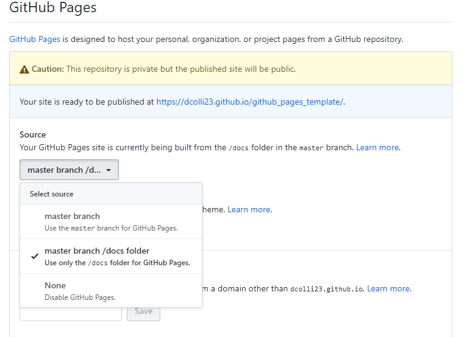

# Getting Started
{:.no_toc}

* TOC
{:toc}

## Overview

This page walks you through the process of creating a GitHub Pages documentation site for your repository. 

## Setting Up Your Documentation Site

To begin building out your documentation website, you will need to set up the initial structure in your own repository.

### Building Your GitHub Pages Site From Our Template

Much of the work has been done for you in setting up the GitHub Pages site via a template that can be downloaded as a zip file [at this link](template/github_pages_template.zip). Download this template and place the `docs` folder in your repository.

This template lays most of the groundwork necessary for the GitHub pages repository. To 

 And in fact, can be committed and built by GitHub right out of the box. But first, you must enable GitHub to build GitHub Pages websites for you from within the repository.

### Enabling GitHub Pages For Your Repository

Before GitHub will build your Pages site for you, you will need to enable it from the repository settings from on the GitHub website. To do this, follow these steps:

1. Go to your repository's "Settings" tab on the GitHub website. We have included a picture of where this is located in the repository's navigation bar on GitHub below:
    
2. Scroll down to the "GitHub Pages" settings in the "Settings" tab. This will look like the following picture:
    
3. Click the "Source" dropdown menu and click the "master branch /docs folder" option.
    

    This will publish your GitHub Pages website to `https://<YOU_GITHUB_USERNAME>.github.io/<REPO_NAME>/`.

## Building Your Documentation Site Further

Now that the groundwork has been laid for your GitHub Pages website, it's time to build out your website. There are a few conventions that we use that we'll spell out below.

1. All pages of your website go in the pages folder.
    1. This is a rather simple rule to follow, but important nonetheless. All pages that you create for your website need to go in the folder located at `docs/pages`.
2. Each new page goes in a new folder.
    1. This convention is pretty self explanatory, but every new page is placed in a new folder. This helps with organizing images and the structural layout of your website.
3. Nest pages and folders that go together.
    1. To keep things organized both on your website and in your `docs` folder, it helps to nest pages that are related. For example, look to the left of this page at the navigation bar. There are multiple topics written about GitHub Pages. To organize this, we have grouped these concepts together. You can see how we've organized this page in this GitHub repository located [at this link](https://github.com/Campbell-Muscle-Lab/howtos_GitHub/tree/master/docs/pages/github_pages).