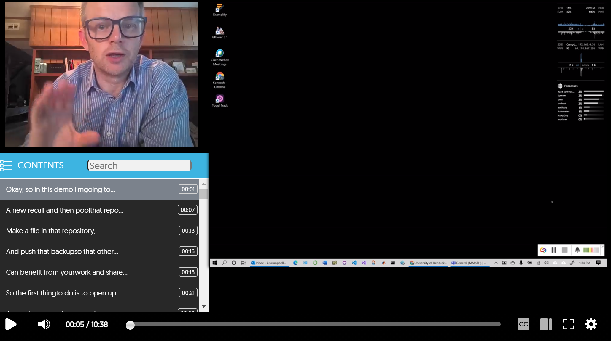

# GitHub Repos

[Git](https://en.wikipedia.org/wiki/Git) is software for tracking and synchronizing files. It is very powerful but also quite complicated.

[GitHub](https://en.wikipedia.org/wiki/GitHub) is software that makes it easier to use Git. In our lab, we use:
+ GitHub's [main website](https://www.github.com)
+ GitHub's [desktop client](https://desktop.github.com/)

## Getting started

Git and GitHub can be quite complicated at first although many [help pages](#additional-resources) are available.

To get started using GitHub in the Campbell lab
+ sign up for a GitHub user account
  + a free one is all you need
+ [email Ken](mailto:k.s.campbell@uky.edu) and let him know the username
  + Ken will add you to the lab's organization on GitHub and let you know when this has been done

## Install the desktop client

The desktop client allows us to do everything we need by pointing and clicking. This is much easier than using Git from the command line.

To install the client
+ Go to [desktop client](https://desktop.github.com/)
+ Follow the instructions

## Terminology

### Repository

In Git, a repository (repo) is a set of files that are grouped together for a purpose. The repository might be source code for a big software project, or a collection of files (images, Word documents, etc.) associated with a manuscript. The repository is version controlled so you can track changes to each file and revert back to previous stages if you need to. You can also add and delete files at any time.

### Commit

When you commit a repo, you store the current version of the file structure on your local computer. You can revert back to that if you need to.

### Push

When you push a repo, you send your commits to a central system where it can be accessed by others.

### Pull

When you pull a repo, you download the latest version of the repository from the central system.

## Example

This video shows how to:
+ create a new repository
+ commit files to the repository
+ push files to GitHub
+ pull files from GitHub

### Demonstration video

### Additional Resources
+ [GitHub Docs](https://help.github.com/en/github/getting-started-with-github)
+ [Atlassian Git Tutorials](https://www.atlassian.com/git/tutorials)
